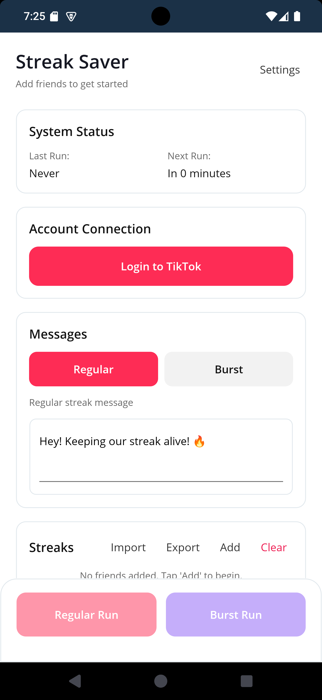

# 🔥 Streak Saver

**Automatically send TikTok messages to keep your streaks alive!**

Streak Saver is an open-source Android app that runs in the background and automatically sends messages to your TikTok friends every 23 hours, ensuring you never lose your streaks.

<p align="center">
  
</p>

## ✨ Features

- **🕐 Automatic Scheduling** - Sends messages on your **Schedule interval** (default 23 hours; configurable between 15 minutes and 23h 59m)
- **👥 Multiple Friends** - Configure multiple friends to maintain streaks with
- **📱 Background Service** - Works even when the app is closed
- **🔔 Smart Notifications** - Shows progress only while sending, then disappears
- **🔄 Boot Persistence** - Automatically reschedules after device restart
- **🔐 Session Management** - Login once, stays logged in
- **⚡ Battery Optimized** - Requests battery optimization exemption for reliability
- **⚙️ Settings Drawer** - **Background automation**, **Skip unreachable users**, and **Burst chat mode** live under **Settings**; the bottom run bar hides while the drawer is open
- **💬 Regular & Burst Messages** - One **Messages** card with **Regular** and **Burst** tabs: edit the regular streak message or burst pattern, timing, and chunk count; choosing **Regular** turns burst mode off, choosing **Burst** turns it on
- **🧭 Skip Unreachable** - Optional behavior (on by default for new installs) to continue with other friends when a chat cannot be opened
- **📦 In-App Updates** - Check for updates from the app; downloaded APKs install via the system installer (FileProvider on Android)
- **🔄 Up-to-Date Automation** - TikTok WebView automation script maintained for current inbox behavior

## 📋 Requirements

- Android 7.0 (API 24) or higher
- TikTok account
- Internet connection

## 📥 Installation

### Option 1: Download APK (Recommended)

1. Go to the [Releases](../../releases) page
2. Download the latest `StreakSaver-vX.X.X.apk`
3. Enable "Install from unknown sources" on your Android device
4. Install the APK

### Option 2: Build from Source

```bash
# Clone the repository
git clone https://github.com/Jon2G/TiktokStreakSaver.git
cd TiktokStreakSaver

# Build for Android
cd src/TiktokStreakSaver
dotnet build -f net9.0-android -c Release
```

## 🚀 Getting Started

1. **Open the app** and tap **Login to TikTok**
2. **Sign in** to your TikTok account in the WebView
3. **Add friends** via **Add** on the Streaks card (TikTok username; optional display name)
4. **Compose messages** in **Messages**: use the **Regular** tab for your normal streak text, or **Burst** for multi-chunk messages with delays (burst mode turns on when you select the Burst tab, and off when you select Regular)
5. **Automation & options** — tap **Settings** to open the side drawer:
   - **Background automation** — on by default for new installs; arms the next background run after first launch on Android when enabled
   - **Skip unreachable users** — on by default for new installs
   - **Burst chat mode** — off by default; must be on for **Burst Run** behavior during automation
6. **Schedule interval** — scroll to the card **above** “Check for updates”; set hours/minutes between successful automatic runs
7. **Grant permissions** from the bottom bar when prompted (exact alarms, battery, notifications)

Use **Regular Run** / **Burst Run** for an immediate send, or rely on background automation when scheduled.

## ⚙️ How It Works

```
┌─────────────────────────────────────────────────────────────┐
│                      Streak Saver                           │
├─────────────────────────────────────────────────────────────┤
│                                                             │
│  [App Start] → Schedule 23hr Alarm                          │
│        ↓                                                    │
│  [Every 23hrs] → AlarmReceiver triggers                     │
│        ↓                                                    │
│  [StreakService] → Start Foreground Service                 │
│        ↓                                                    │
│  [WebView] → Load TikTok Messages                           │
│        ↓                                                    │
│  [For each friend] → Find chat → Send message               │
│        ↓                                                    │
│  [Complete] → Schedule next run → Stop service              │
│                                                             │
└─────────────────────────────────────────────────────────────┘
```

## 🛠️ Tech Stack

- **.NET 9 MAUI** - Cross-platform framework
- **Android WebView** - TikTok web automation
- **AlarmManager** - Precise 23-hour scheduling
- **Foreground Service** - Reliable background execution
- **JavaScript Injection** - Web page automation

## 📁 Project Structure

```
TiktokStreakSaver/
├── src/TiktokStreakSaver/
│   ├── Models/                    # Data models
│   ├── Services/                  # Business logic services
│   ├── Platforms/Android/
│   │   ├── Services/              # Android foreground service
│   │   ├── Receivers/             # Alarm & boot receivers
│   │   └── Resources/             # Android resources
│   ├── Resources/                 # MAUI resources (icons, fonts)
│   ├── MainPage.xaml              # Main UI
│   └── LoginPage.xaml             # TikTok login WebView
├── .github/workflows/             # CI/CD pipelines (see below)
├── .github/dependabot.yml         # Dependency update PRs (Actions + NuGet)
└── docs/                          # Documentation & screenshots
```

### Continuous integration

| Workflow | When it runs | What it does |
|----------|----------------|----------------|
| [`ci.yml`](.github/workflows/ci.yml) | Push to `main` / `master`, all pull requests, manual | `dotnet build` for **Android** and **Windows** (Debug, no signing) |
| [`android-release.yml`](.github/workflows/android-release.yml) | Git tag `v*`, manual dispatch | Signed Release APK, artifact upload, GitHub Release |

## 🔧 Configuration

### Changing the interval

On the main screen, **Schedule interval** is the last main section **before** the footer (“Check for updates”). Use hours and minutes to set how long to wait after each successful run before the next automatic background run. Allowed range is **15 minutes** up to **23 hours 59 minutes** (always less than 24 hours). The default matches the classic **23 hours**.

### Burst messaging

On the **Messages** card, open the **Burst** tab to edit the burst pattern, **messages per friend** (2–5), and **min/max delay** (seconds) between chunks. Burst mode for runs and automation is controlled by **Burst chat mode** in **Settings**.

### Custom Message

You can set any message in the app's UI. The default message is:
```
Hey! Keeping our streak alive! 🔥
```

## 🤝 Contributing

Contributions are welcome! Here's how you can help:

1. **Fork** the repository
2. **Create** a feature branch (`git checkout -b feature/amazing-feature`)
3. **Commit** your changes (`git commit -m 'Add amazing feature'`)
4. **Push** to the branch (`git push origin feature/amazing-feature`)
5. **Open** a Pull Request

### Development Setup

```bash
# Prerequisites
- .NET 9 SDK
- Visual Studio 2022 or VS Code with C# extension
- Android SDK (API 24+)

# Install MAUI workload
dotnet workload install maui-android

# Restore and build
cd src/TiktokStreakSaver
dotnet restore
dotnet build -f net9.0-android
```

## ⚠️ Disclaimer

This app is for educational purposes only. Use responsibly and in accordance with TikTok's Terms of Service. The developers are not responsible for any account restrictions or bans that may result from using this application.

## 📄 License

This project is licensed under the MIT License - see the [LICENSE](LICENSE) file for details.

## 🙏 Acknowledgments

- Built with [.NET MAUI](https://dotnet.microsoft.com/apps/maui)
- Inspired by the need to never lose a streak again

---

<p align="center">
  Made with ❤️ and 🔥
</p>
